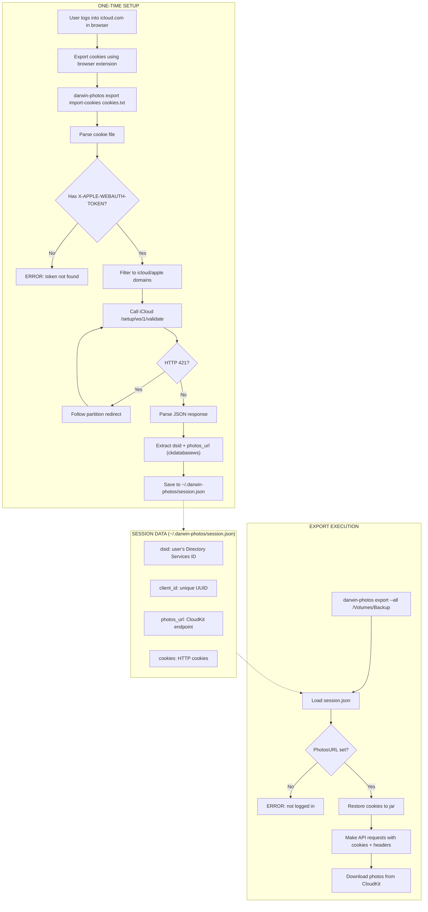

# Export Authentication Flow

```mermaid
flowchart TD
    subgraph setup["ONE-TIME SETUP"]
        A[User logs into icloud.com in browser] --> B[Export cookies using browser extension]
        B --> C["darwin-photos export import-cookies cookies.txt"]
        C --> D[Parse cookie file]
        D --> E{Has X-APPLE-WEBAUTH-TOKEN?}
        E -->|No| F[ERROR: token not found]
        E -->|Yes| G[Filter to icloud/apple domains]
        G --> H[Call iCloud /setup/ws/1/validate]
        H --> I{HTTP 421?}
        I -->|Yes| J[Follow partition redirect]
        J --> H
        I -->|No| K[Parse JSON response]
        K --> L["Extract dsid + photos_url (ckdatabasews)"]
        L --> M["Save to ~/.darwin-photos/session.json"]
    end

    subgraph export["EXPORT EXECUTION"]
        N["darwin-photos export --all /Volumes/Backup"] --> O[Load session.json]
        O --> P{PhotosURL set?}
        P -->|No| Q[ERROR: not logged in]
        P -->|Yes| R[Restore cookies to jar]
        R --> S["Make API requests with cookies + headers"]
        S --> T[Download photos from CloudKit]
    end

    subgraph session["SESSION DATA (~/.darwin-photos/session.json)"]
        U["dsid: user's Directory Services ID"]
        V["client_id: unique UUID"]
        W["photos_url: CloudKit endpoint"]
        X["cookies: HTTP cookies"]
    end

    M -.-> session
    session -.-> O
```
